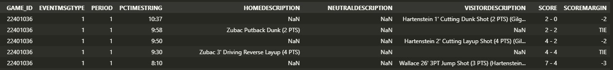

# LA Clippers 2025 Performance

In this repository we will analyze the performance of the <b>Los Angeles Clippers 🏀</b> during the <b>2024-2025 NBA Regular Season</b> using data analysis techniques with Python. The main goal is to extract meaningful insights from team and player statistics to evaluate strengths, weaknesses, and trends throughout the season.

> ⚠️ <b>This project was carried out with the sole purpose of developing my analytical and technical skills in data analysis.</b>

## 📌 Index

> 1.  [Introduction](#1-introduction)
>
> > 1.1 [Overview of the project](#11-overview-of-the-project)
>
> > 1.2 [Project Goals](#12-project-goals)
>
> 2.  [Dataset](#2-dataset)
>
> 3.  [Methodology]
>
> 4.  [Performance Analysis]
>
> 5.  [Visualization & Insights]
>
> 6.  [Conclusions & Findings]
>
> 7.  [References & Ack](#7-references--acknowledgments)
>
> 8.  [Appendix](8-appendix)

## 1. Introduction

Anyone who has followed this team throughout the season will agree that it has been a particularly challenging one. For those who did not...

According to [Odds to Make the 2024-2025 NBA Playoffs](https://www.sportsoddshistory.com/nba-win/?y=2024-2025&sa=nba&t=post&o=mk) by Sports Odd History, the Los Angeles Clippers were ranked as the 12th team in the Western Conference in terms of postseason chances, before the start of the season. They [lost key players from their 2023–2024 roster](https://www.si.com/nba/clippers/news/paul-george-breaks-silence-on-leaving-clippers-for-76ers-01j2723fea3v#:~:text=Paul%20George%20shocked%20the%20NBA,silence%20in%20a%20press%20release.), and their highest-paid player, Kawhi Leonard, [was sidelined for most of the early part of the season](https://www.nba.com/news/kawhi-leonard-season-debut). Most sports analysts weren’t giving them much of a chance to enter the PlayOffs.

However, by the time they entered their 72nd game of the season, they held a 40-31 record—just half a game away from securing the 6th seed and earning a direct Playoff spot, avoiding the Play-In tournament.

So, how did this team exceed early expectations? How did they defy the odds? What insights can help us understand their performance? Was their success consistent or marked by irregularities? Let’s find out.

We will analyze the Clippers’ game data in an effort to understand and address these questions.

### 1.1 Overview of the project

This project analyzes the performance of the Los Angeles Clippers, focusing on key basketball metrics such as points scored, wins, etc. By leveraging basic game data, we explore scoring patterns, win probabilities, and trends in the team's performance over time. The project combines data extraction, transformation, and analysis to derive actionable insights, offering a clear view of the Clippers' gameplay dynamics and efficiency. Through this work, we aim to highlight how fundamental statistics can reveal meaningful trends in professional basketball.

### 1.2 Project Goal

The goal of this project was to identify the key factors that led the Los Angeles Clippers to win games and to understand the patterns contributing to their losses.

## 2. Dataset

The dataset utilized in this analysis was sourced from the [Official NBA Stats](https://www.nba.com/stats) website using the [`nba_api` by @swar](https://github.com/swar/nba_api).

To assess the performance of the LA Clippers, we extracted the game results for the 2024–2025 Regular Season. The original dataset included the following fields:

`'SEASON_ID', 'TEAM_ID', 'TEAM_ABBREVIATION', 'TEAM_NAME', 'GAME_ID',  
 'GAME_DATE', 'MATCHUP', 'WL', 'MIN', 'PTS', 'FGM', 'FGA', 'FG_PCT',  
 'FG3M', 'FG3A', 'FG3_PCT', 'FTM', 'FTA', 'FT_PCT', 'OREB', 'DREB',  
 'REB', 'AST', 'STL', 'BLK', 'TOV', 'PF', 'PLUS_MINUS'`

All statistical data (e.g., `PTS`, `FGM`, etc.) refers specifically to the LA Clippers.

For the purposes of our analysis, the dataset was reduced to retain only the following columns:

`'TEAM_ID', 'TEAM_ABBREVIATION', 'TEAM_NAME', 'GAME_ID', 'GAME_DATE', 'MATCHUP', 'WL', 'PTS', 'PLUS_MINUS'`.

Descriptions of the retained fields are as follows:

- `TEAM_ID`: Unique identifier for the LA Clippers (`1610612746`).
- `TEAM_ABBREVIATION`: Team abbreviation (`LAC`).
- `TEAM_NAME`: Team name (`LA Clippers`).
- `GAME_ID`: Unique identifier for each game.
- `GAME_DATE`: Date of the game in `yyyy-mm-dd` format (`str`).
- `MATCHUP`: Game matchup information (e.g., `LAC @ NYK`).
- `WL`: Game outcome (`W` for win, `L` for loss).
- `PTS`: Total points scored by the Clippers. \*later renamed as `LAC_PTS`.
- `PLUS_MINUS`: Point differential between the Clippers and their opponent.

For future procedures we built new columns:

- `OPP_PTS`: Total points scored by the opponents of the Clippers.
- `OPT_TEAM_ABBREVIATION`: Abbreviation of the oponent team (e.g., `NYK`).
- `HA`: Court advantage (`H` for home games, `A` for away games).

Using the `GAME_ID` and the `nba_api`'s `playbyplay.PlayByPlay(game_id)` method, we extracted all plays for each game. This method returns a dataframe, from which we selected the following columns:

- `GAME_ID`: Unique identifier for the game.
- `EVENTMSGTYPE`: Integer indicating the type of play (e.g., defensive action, scoring event, substitution).
- `PERIOD`: The quarter in which the play occurred.
- `PCTIMESTRING`: Time remaining in the quarter.
- `HOMEDESCRIPTION`: Description of the play from the perspective of the home team.
- `NEUTRALDESCRIPTION`: Description of the play not specific to either team.
- `VISITORDESCRIPTION`: Description of the play from the perspective of the visiting team.
- `SCORE`: The score at the time of the play.
- `SCOREMARGIN`: The point differential between the home and visiting teams.

This is how the original playsDF looked:

To focus on plays impacting the score, we filtered the dataset to include only scoring events. Using `PCTIMESTRING` and `PERIOD`, we created a new column, `TIME_PLAYED`, which stores the cumulative game time for each play, where `00:00` marks the game’s start and `48:00` represents the end of regulation time. Additionally, we added a column named `LAC_PTS` to capture the Los Angeles Clippers' points for each play and narrowed the dataframe to include only their plays.

At the end this is how our ClippersPlaysDF looked like:

All processes related to the extraction and transformation of the data used in this project are documented in the corresponding scripts and notebooks: [`data_loader.ipynb`](data_loader.ipynb).

## 3. Methodology

## 7. References & Acknowledgments

### 7.1 References

- **NBA API**: The primary source for play-by-play game data, accessed through the `nba_api` Python library. This project relied heavily on its comprehensive basketball statistics. [Documentation](https://github.com/swar/nba_api).

- **Python Libraries**: Utilized `Pandas` for data manipulation, `NumPy` for numerical analysis and `Seaborn` for data visualization, enabling efficient processing of the Clippers' performance metrics.

### 7.2 Acknowledgments

- **NBA**: Gratitude to the NBA for being a pioneering data-driven organization in sports, providing rich and accessible basketball data that fuels projects like this one.

- **ESPN**: A special thanks to ESPN for their insightful game analyses, which inspired us to analyze LA Clippers 2024-2025 season.

## 8. Appendix

**Figure 1: Example of ESPN-Style Game Analysis**

*Description*: This sample visualization, inspired by ESPN’s basketball analytics, illustrates a breakdown of scoring trends and key plays in an NBA game. It highlights metrics like points scored and scoring margins, similar to those analyzed in our study of the Clippers’ wins and losses. This style motivated our approach to uncovering patterns in basic game data.
